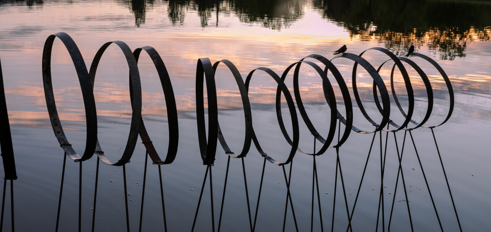
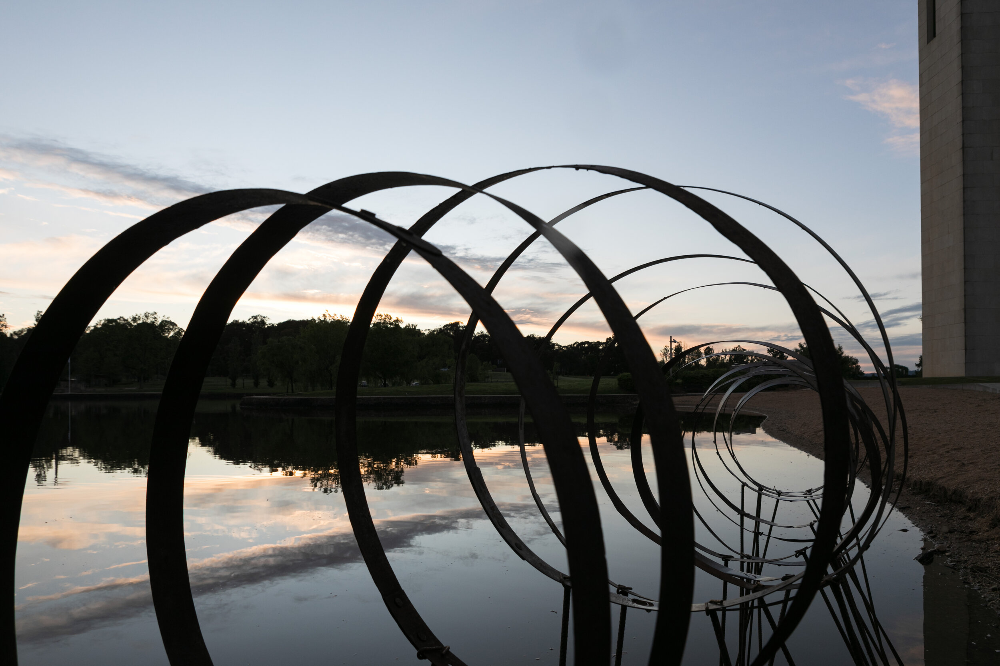
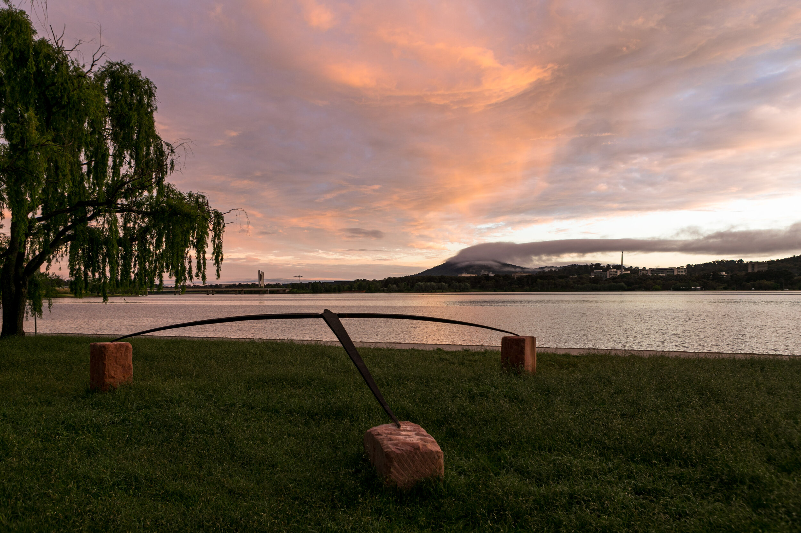
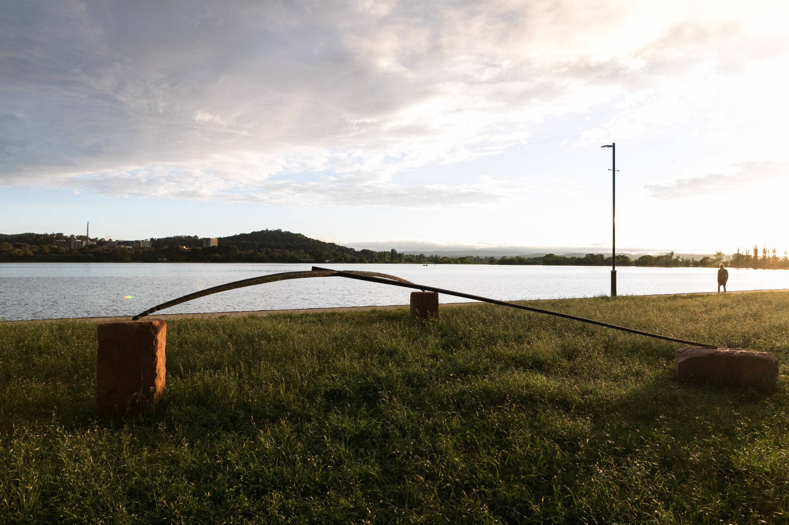

---
# set the layout to use, in this case, the homepage one
layout: layouts/homepage

# set the page title
title: Canberra Art Biennial

# We can set extra info here to use in our templates

---

# Contour 556 / 2020

### 9 - 31 OCTOBER 2020

## The third edition of contour 556 concluded on Saturday October 31st 2020.
The event launched on Friday 9th October, at King O’Malleys outdoor roof terrace at 131 City Walk, Civic. contour 556 was opened by Senator Katy Gallagher, to an enthusiastic crowd of 120 people.

# Artists
## Lizzie Hall
### Neil Hobbs, May 25, 2020

## HOOPS CONTOUR 556 / 2020

ABOUT THE WORK:
a series of steel hoops coming out of the water on the edge of the lake at Aspen Island.

ABOUT THE ARTIST:
Lizzie Hall studied Printmedia and Drawing at the Canberra School of Art graduating with honours in 2000. She works in painting, drawing and sculpture. She has been a finalist in various awards including the Brett Whiteley Travelling Art Scholarship, the Redlands Art Prize and the Woollahra Small Sculpture Prize. She currently works from her studio in Braidwood, NSW. 

## Greg Johns
### Neil Hobbs, May 4 2020
## HOVERING FIGURE CONTOUR 556 / 2020

ABOUT THE WORK:
Hovering Figure is a Corten steel sculpture which was inspired by the extraordinary Wedge Tail eagles which hover over the rock escarpment on my property at Palmer in South Australia.  At this site a smaller version sits/floats on the edge of the actual rock escarpment, suspended between two large rocks. The larger version I will show in Canberra is 756 cm wide x 582 cm long. It can sit/hover at various heights above the ground, suspended by rocks at 3 points. The site will determine the height. There is also a textured pattern that runs across its entire surface reflective of the Australian landscape as seen from above. At the Contour 556 exhibition it should float both subtly and dramatically in the large open space there, mimicking the wedge tail eagles which glide across our broad blue skies, floating above our profoundly ancient and unique landscape.

ABOUT THE ARTIST:
Greg has been working as a full-time sculptor for 44 years, completing major commissions in Australia and internationally, as well as exhibiting annually in solo/  major group shows in Australia, New York, Asia, the Middle East and Europe. In 2001 he initiated an independent sculpture and environmental landscape at Palmer. In 2012 he was the recipient of the McClelland Museum Sculpture Prize. A second monograph by John Neylon, “Edge Of Time” was published in 2015. Major commissions completed include, “From The Centre – To The Centre”, 2016, “Landlines” Gawler Entrance, 2017, “To The Centre”, England, 2018/19, M5 Expressway project, Sydney, 2020. 

# Locations

SPRINGBANK ISLAND / AUSTRALIAN NATIONAL UNIVERSITY / CIVIC SQUARE / WEST BASIN / 8 PETRIE PLAZA / 16 MARCUS CLARKE STREET / KING O’MALLEYS /HENRY ROLLAND PARK / LAKE BURLEY GRIFFIN CENTRAL BASIN / COMMONWEALTH PLACE / BOWEN PLACE / ASPEN ISLAND / BOWEN PARK / BARTON ARTBOX - 7 YOUNG STREET, BARTON /  COX GALLERY / CANBERRA GLASSWORKS / THOR’S HAMMER MIXING ROOM GALLERY / CANBERRA MUSEUM AND GALLERY

# Stay tuned for Contour 556 / 2022 by keeping an eye on our socials

 

