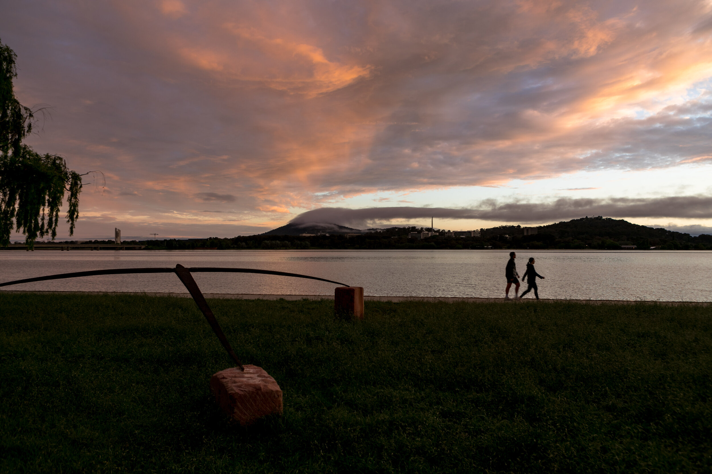

---
# set the layout to use, in this case, the homepage one
layout: layouts/homepage

# set the page title
title: Canberra Art Biennial

# We can set extra info here to use in our templates

---

# Contour 556 / 2020

### 9 - 31 OCTOBER 2020

## The third edition of contour 556 concluded on Saturday October 31st 2020.
The event launched on Friday 9th October, at King O’Malleys outdoor roof terrace at 131 City Walk, Civic. contour 556 was opened by Senator Katy Gallagher, to an enthusiastic crowd of 120 people.

# Artists
## Lizzie Hall
### Neil Hobbs, May 25, 2020

## HOOPS CONTOUR 556 / 2020

ABOUT THE WORK:
a series of steel hoops coming out of the water on the edge of the lake at Aspen Island.

ABOUT THE ARTIST:
Lizzie Hall studied Printmedia and Drawing at the Canberra School of Art graduating with honours in 2000. She works in painting, drawing and sculpture. She has been a finalist in various awards including the Brett Whiteley Travelling Art Scholarship, the Redlands Art Prize and the Woollahra Small Sculpture Prize. She currently works from her studio in Braidwood, NSW. 

## Greg Johns
### Neil Hobbs, May 4 2020
## HOVERING FIGURE CONTOUR 556 / 2020

